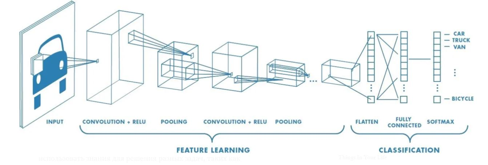
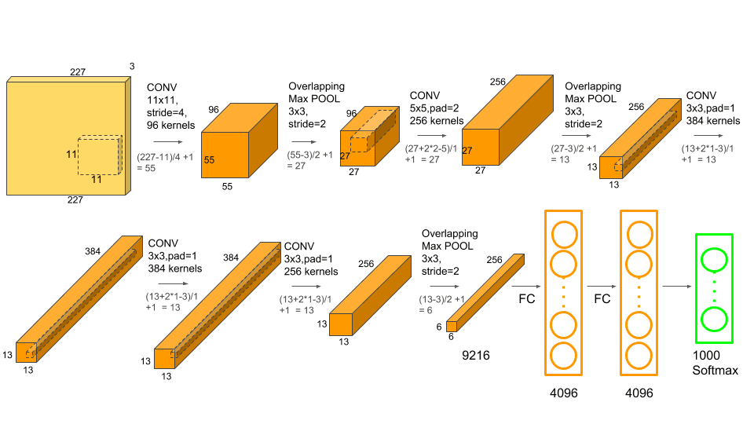
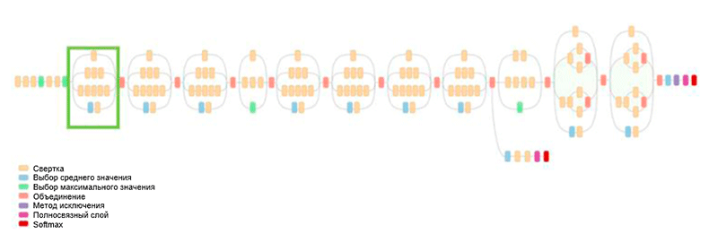
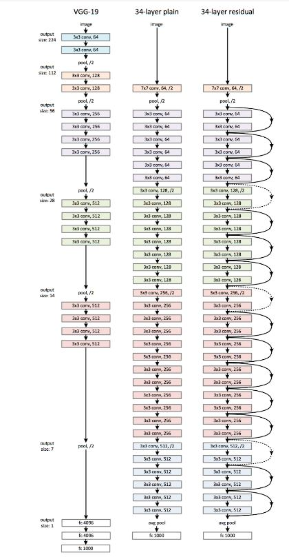

# Лабораторная работа №3

---

## **Цель работы:**

Освоить методы разработки элементарных систем классификации изображений, используя сверточные нейронные сети. Провести соответствующие исследования.

**Задание:**

1. Реализовать систему классификации согласно описанию, используя не менее трех различных архитектур нейронной сети.
2. Сравнить качество работы, скорость и количество потребляемой памяти для каждой архитектуры.
3. Сделать отчёт в виде readme на GitHub, там же должен быть выложен исходный код.

**Описание:**

Необходимо реализовать простейшую систему классификации изображений на основе сверточных нейронных сетей. Возможно использовать любые доступные технологии, рекомендованный список такой: • Google Colab для запуска (можно другую платформу или локальную машину) • PyTorch • Torchvision Система должна загружать изображение с диска, преобразовывать в нужный для обработки моделью нейронной сети формат (тензор), выполнять предобработку, если требуется (например, изменение размера и нормирование), затем обрабатывать с помощью нейронной сети и выводить результат (номер класса, название, его вероятность для первых 5 наиболее вероятных классов).Необходимо провести исследование по сравнению эффективности трех разных архитектур (можно использовать предобученные модели из torchvision.models [Models and pre-trained weights &mdash; Torchvision main documentation](https://pytorch.org/vision/stable/models.html), например, AlexNet, RegNet, ResNet50). Нужно узнать, на каком датасете предобучены данные модели (использовать веса, полученные с одного и того же набора) и найти список классов, которые они предсказывают. Каждую модель необходимо протестировать на вашем собственном наборе из не менее чем 50 изображений (можно использовать любые изображения, но не те, которые использовались для обучения), в качестве метрик использовать top-1 accuracy и top-5 accuracy. В данной работе не требуется проводить обучение нейронной сети (только по желанию).


## Теоретическая база

---

 Сегодня для обработки изображений распространенным методом является использование сверточных нейронных сетей (ConvNet/CNN - convolutional neural network). На рисунке ниже представлен пример такой архитектуры.




Рис.1 - Пример сверточной нейросети для определения изображения легкового автомобиля


Данная нейросеть включает в себя несколько типов слоев, включая входной слой, сверточные слои, слои пулинга и полносвязный слой. Из названия понятно, что назначение входного слоя заключается в принятии исходного изображения. Одной из особенностей таких нейросетей является наличие сверточных слоев, которые выполняют операцию умножения каждого фрагмента изображения на матрицу свёртки поэлементно, а результат суммируется и записывается в аналогичную позицию выходного изображения.


Рис.2 - Анимация процесса свёртки


Берется некоторая небольшая матрица (3х3х1, 5х5х1 или иное), и “сдвигается” по матрице изображения. При наложении на определенную область берется умножение матрицы ядра на фрагмент изображения, результат записывается в ячейку новой матрица. Эта матрица уже будет содержать меньше ячеек, но при этом будет хранить определенные признаки исходного изображения. Таких “сверток” в СНС множество, это позволяет получать наборы “особенностей/признаков” (features) - например, особого рода краев, которые можно использовать для соотнесения изображения к определенному классу. 

Назначение слоев пулинга - уменьшение размерности получаемых данных. В процессе пулинга выбираются самые существенные признаки. 

Конкретное решение, к какому классу относится входной объект(т.е. набор карт признаков) принимается в полносвязном слое (FC). 

Применение СНС позволяет решить две проблемы изображений как данных:

1. Снизить кол-во анализируемых сигналов в нейросети(вместо огромного кол-ва узлов полносвязной нейросети - посредовательное извлечение признаков с уменьшением размерности данных;

2. Анализировать пиксели в контексте окружения, выявлять признаки;


Существуют разные архитектуры CNN, послужившие ключом при создании алгоритмов, которые обеспечивают и продолжат обеспечивать работу ИИ в обозримом будущем. Некоторые из них:

1. LeNet;

2. AlexNet;

3. VGGNet;

4. GoogLeNet;

5. ResNet;

6. ZFNet.
   
   

В данной работе рассмотрены такие архитектуры:

- AlexNet

- GoogLeNet

- ResNet

Архитектуры доступны в хранилище фреймворка PyTorch и обучались по датасету ImageNet


##### **AlexNet**



Рис.3 - Архитектура AlexNet


Данная нейросеть предложена А. Крижевским, И. Сатскевером и Дж. Хинтоном из Университета Торонто. C большим отрывом выиграла конкурс по распознаванию изображений ImageNet LSVRC-2012 в 2012 году (с количеством ошибок 15,3% против 26,2% у второго места) и оказала большое влияние на развитие алгоритмов компьютерного зрения.  Это была новаторская работа, в которой авторы впервые использовали (на тот момент) глубокие сверточные нейросети с общей глубиной в восемь слоев (пять сверточных и три полносвязных слоя).


##### **GoogLeNet**



Рис.4 - Архитектура GoogLeNet


Ранее все развитие архитектуры заключалось в упрощении фильтров и увеличении глубины сети. В 2014 году К. Сегеди (C. Szegedy) совместно с другими участниками предложил совершенно иной подход и создал самую сложную на тот момент времени архитектуру, называемую GoogLeNet.

Одним из основных достижений данной работы является так называемый модуль **Inception**, который показан на рисунке ниже. Сети других архитектур выполняют обработку входных данных последовательно, слой за слоем, в то время как при использовании модуля Inception входные данные обрабатываются в параллельном режиме. Это позволяет ускорить получение вывода, а также минимизировать общее количество параметров.


##### ResNet



Рис.5 - Архитектура ResNet


Сеть, победившая в конкурсе ImageNet Challenge в 2015 году, содержала 152 слоя. Кроме того, данная идея позволила сократить число ошибок для пяти ведущих категорий буквально в два раза — до значения в 3,6 процента. Согласно исследованию [Чему я научился, соревнуясь со сверточной нейросетью на конкурсе ImageNet](http://karpathy.github.io/2014/09/02/what-i-learned-from-competing-against-a-convnet-on-imagenet/), проведенному А. Карпати (A. Karpathy), производительность человека для этой задачи составляет примерно 5 процентов. Это означает, что архитектура ResNet способна превзойти человеческие результаты, по крайней мере в данной задаче классификации изображений.

Идея - использование т.н. остаточные (residual) связи для подавления эффекта “исчезающего градиента”. Т.е. позволить сети изучать остаточное отображение (элемент, который следует добавить ко входным данным) вместо отображения как такового. Благодаря этой идее можно обучать очень глубокие, чрезвычайно глубокие сети.

## Описание разработанной системы

---

Для реализации программы использовался язык Python, а Google Colab-файл доступен в репозитории в папке src и онлайн по ссылке на Google Colab. Для создания нейросетей были использованы готовые предобученные модели из библиотеки torchvision. Нейросети были обучены на датасете ImageNet. Списки классов, которые нейросети могут предсказывать, можно скачать по ссылке.

Для теста использовался датасет из 50-ти фотографий лошадей, собранных случайным образом из интернета. Ссылка -

Разработаны три модели на основе архитектур AlexNet, ResNet50 и RegNet. Общий алгоритм программы включает следующие шаги: 

- импорт библиотек;

- загрузка датасета, предобученной модели и списка классов;

- подготовка датасета, включая загрузку изображений в память;

- нормализация и формирование массива тензоров;

- подготовка предобученной нейронной сети для заданной модели;

- прогон всех изображений датасета;

- вывод на экран топ-5 наиболее вероятных меток и вероятностей для каждого изображения;

- формирование общего топ-5 для всех изображений датасета;

В процессе работы программы также собираются данные о быстродействии и затратах памяти.

## Результаты работы и тестирования системы

---

### Сравнение времени исполнения:

- AlexNet: 2.742s

- GoogLeNet: 7.146s

- ResNet50: 9.327s

### Сравнение затраченной памяти (torch.profiler):

- AlexNet: 92.50 Mb

- GoogLeNet: 1.09 Gb

- ResNet50: 2.62 Gb

### Предсказанные классы (top-5 accuracy):

- AlexNet: 'sorrel', 'Great Dane', 'Saluki', 'ox', 'Rhodesian ridgeback'

- GoogLeNet: 'sorrel', 'Saluki', 'whippet', 'hartebeest', 'Great Dane'

- ResNet50: 'sorrel', 'Saluki', 'hartebeest', 'worm fence', 'whippet'


Отчеты профайлера:

**AlexNet:**

```
---------------------------------  ------------  ------------  ------------  ------------  ------------  ------------  ------------  ------------  
                             Name    Self CPU %      Self CPU   CPU total %     CPU total  CPU time avg       CPU Mem  Self CPU Mem    # of Calls  
---------------------------------  ------------  ------------  ------------  ------------  ------------  ------------  ------------  ------------  
                      aten::empty         0.15%       4.115ms         0.15%       4.115ms       7.482us      92.50 Mb      92.50 Mb           550  
    aten::max_pool2d_with_indices         6.00%     164.486ms         6.00%     164.486ms       1.097ms      50.47 Mb      50.47 Mb           150  
                      aten::addmm        46.00%        1.261s        46.10%        1.264s       8.426ms       1.75 Mb       1.75 Mb           150  
                    aten::resize_         0.01%     231.000us         0.01%     231.000us       4.620us       1.34 Mb       1.34 Mb            50  
       aten::_adaptive_avg_pool2d         0.90%      24.546ms         0.91%      24.845ms     496.900us       1.76 Mb     432.00 Kb            50  
                   aten::_softmax         0.04%       1.131ms         0.04%       1.131ms      22.620us     195.31 Kb     195.31 Kb            50  
                       aten::topk         0.06%       1.584ms         0.06%       1.584ms      31.680us       2.93 Kb       2.93 Kb            50  
                     aten::conv2d         0.07%       1.973ms        45.51%        1.248s       4.991ms      92.50 Mb           0 b           250  
                aten::convolution         0.14%       3.798ms        45.44%        1.246s       4.983ms      92.50 Mb           0 b           250  
               aten::_convolution         0.17%       4.737ms        45.30%        1.242s       4.968ms      92.50 Mb           0 b           250  
---------------------------------  ------------  ------------  ------------  ------------  ------------  ------------  ------------  ------------  
Self CPU time total: 2.742s
```

**GoogLeNet**

```
---------------------------------  ------------  ------------  ------------  ------------  ------------  ------------  ------------  ------------  
                             Name    Self CPU %      Self CPU   CPU total %     CPU total  CPU time avg       CPU Mem  Self CPU Mem    # of Calls  
---------------------------------  ------------  ------------  ------------  ------------  ------------  ------------  ------------  ------------  
                      aten::empty         0.69%      49.602ms         0.69%      49.602ms       2.368us       1.09 Gb       1.09 Gb         20950  
    aten::max_pool2d_with_indices        43.81%        3.131s        43.81%        3.131s       4.817ms     811.08 Mb     811.08 Mb           650  
                        aten::cat         0.87%      62.258ms         0.87%      62.258ms     124.516us     264.38 Mb     264.38 Mb           500  
                    aten::resize_         0.14%       9.708ms         0.14%       9.708ms       4.045us     180.08 Mb     180.08 Mb          2400  
                        aten::add         0.09%       6.497ms         0.11%       8.178ms      54.520us      28.71 Mb      28.71 Mb           150  
                        aten::mul         0.11%       7.533ms         0.19%      13.501ms      90.007us      28.71 Mb      28.71 Mb           150  
     aten::_batch_norm_impl_index         0.39%      28.186ms         3.76%     268.442ms      94.190us     615.34 Mb       5.42 Mb          2850  
                     aten::conv2d         0.56%      40.048ms        48.80%        3.487s       1.224ms     615.34 Mb       3.97 Mb          2850  
                 aten::empty_like         0.12%       8.783ms         0.31%      22.305ms       7.826us     615.34 Mb       3.00 Mb          2850  
                aten::convolution         0.34%      24.556ms        48.56%        3.470s       1.218ms     615.34 Mb     404.25 Kb          2850  
---------------------------------  ------------  ------------  ------------  ------------  ------------  ------------  ------------  ------------  
Self CPU time total: 7.146s
```

**ResNet50**

```
---------------------------------  ------------  ------------  ------------  ------------  ------------  ------------  ------------  ------------  
                             Name    Self CPU %      Self CPU   CPU total %     CPU total  CPU time avg       CPU Mem  Self CPU Mem    # of Calls  
---------------------------------  ------------  ------------  ------------  ------------  ------------  ------------  ------------  ------------  
                      aten::empty         0.64%      60.004ms         0.64%      60.004ms       3.069us       2.62 Gb       2.62 Gb         19550  
                    aten::resize_         0.15%      13.879ms         0.15%      13.879ms       8.412us       1.08 Gb       1.08 Gb          1650  
       aten::_slow_conv2d_forward        32.64%        3.045s        32.95%        3.073s       1.862ms       1.53 Gb     464.16 Mb          1650  
    aten::max_pool2d_with_indices         4.72%     440.318ms         4.72%     440.318ms       8.806ms     114.84 Mb     114.84 Mb            50  
     aten::_batch_norm_impl_index         0.29%      26.906ms         6.35%     592.622ms     223.631us       2.07 Gb       7.07 Mb          2650  
                     aten::conv2d         0.32%      29.755ms        84.57%        7.888s       2.977ms       2.07 Gb       6.51 Mb          2650  
                 aten::empty_like         0.09%       8.350ms         0.32%      30.251ms      11.415us       2.07 Gb       2.68 Mb          2650  
                       aten::mean         0.01%       1.098ms         0.07%       6.481ms     129.620us     400.02 Kb     399.93 Kb            50  
                      aten::addmm         0.45%      42.320ms         0.46%      42.860ms     857.200us     195.31 Kb     195.31 Kb            50  
                   aten::_softmax         0.01%     752.000us         0.01%     752.000us      15.040us     195.31 Kb     195.31 Kb            50  
---------------------------------  ------------  ------------  ------------  ------------  ------------  ------------  ------------  ------------  
Self CPU time total: 9.327s
```


## Выводы по работе

---

В процессе работы были созданы простые системы классификации изображений, основанные на сверточных нейронных сетях различных архитектур, включая AlexNet, GoogLeNet и ResNet50. Для тестирования был использован датасет, состоящий из 50 изображений лошадей. Все модели успешно справились с классификацией большинства изображений. Характерно то, что классы были не общие, как например, horse, а были распознаны масти лошадей - sorrel, Saluki. Было обнаружено, что AlexNet обладает наиболее быстрой скоростью распознавания изображений и потребляет меньше памяти при работе. Далее на втором месте оказалась модель GoogLeNet, а самой медленной и ресурсоемкой оказалась архитектура ResNet50.


## Список web-источников

---

- [AI, практический курс. Современные архитектуры глубоких нейронных сетей для классификации изображений / Хабр](https://habr.com/ru/company/intel/blog/417809/)

- [AlexNet — свёрточная нейросеть для классификации изображений](https://neurohive.io/ru/vidy-nejrosetej/alexnet-svjortochnaja-nejronnaja-set-dlja-raspoznavanija-izobrazhenij/)

- [Подробное руководство по свёрточным нейронным сетям](https://medium.com/nuances-of-programming/%D0%BF%D0%BE%D0%B4%D1%80%D0%BE%D0%B1%D0%BD%D0%BE%D0%B5-%D1%80%D1%83%D0%BA%D0%BE%D0%B2%D0%BE%D0%B4%D1%81%D1%82%D0%B2%D0%BE-%D0%BF%D0%BE-%D1%81%D0%B2%D1%91%D1%80%D1%82%D0%BE%D1%87%D0%BD%D1%8B%D0%BC-%D0%BD%D0%B5%D0%B9%D1%80%D0%BE%D0%BD%D0%BD%D1%8B%D0%BC-%D1%81%D0%B5%D1%82%D1%8F%D0%BC-%D0%BF%D0%BE%D0%B4%D1%85%D0%BE%D0%B4-%D1%81-eli5-15d4d912f02f)

- [CS231n: Свёрточные нейронные сети для распознавания образов / Хабр](https://habr.com/ru/post/456186/)

- [AlexNet - Wikipedia](https://en.wikipedia.org/wiki/AlexNet)
